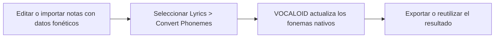
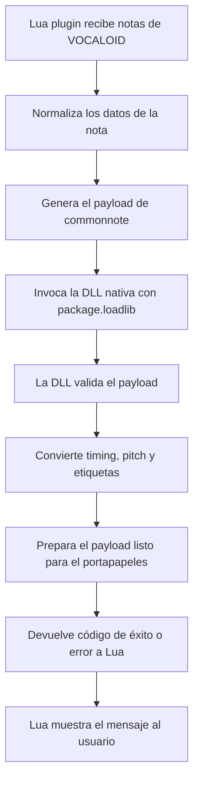

# commonnote para VOCALOID

Selecciona un idioma / Choose a language / 言語を選択:

- [English](README.md)
- [Español](README.es.md)
- [日本語](README.ja.md)

Este proyecto es un Job Plugin para VOCALOID que intercambia datos de notas en el formato original commonnote de ExpressiveLabs.

El script Lua es la capa que interactúa con el host. Lee la parte actual de VOCALOID, crea el payload para el portapapeles y carga la biblioteca nativa del mismo directorio que el script.

Importante: este documento explica el contrato de integración y la estructura de carpetas. La implementación en Rust no se incluye aquí por diseño; el código nativo vive en un proyecto Rust separado y se carga en tiempo de ejecución mediante `package.loadlib`.

## Créditos y proyectos públicos relacionados

Este plugin se basa en el formato original commonnote, creado y mantenido por ExpressiveLabs.

- Proyecto original: [ExpressiveLabs/commonnote](https://github.com/ExpressiveLabs/commonnote)
- Crate en Rust: [commonnote en crates.io](https://crates.io/crates/commonnote)

Entre las implementaciones públicas y proyectos relacionados que usan o soportan este formato se encuentran:

- [Mikoto Studio](https://mikoto.studio/) — usa commonnote como estructura de datos predeterminada para el portapapeles.
- [OpenUTAU](https://github.com/stakira/OpenUtau) — host compatible con commonnote.
- [UtaUtaUtau/commonnote-svs](https://github.com/UtaUtaUtau/commonnote-svs) — implementación para Synthesizer V Studio.
- [oxygen-dioxide/commonnote-utau](https://github.com/oxygen-dioxide/commonnote-utau) — implementación para UTAU.

Este proyecto sigue la especificación original de commonnote y respeta la autoría del proyecto base sin reemplazarla ni reinterpretarla.

## 1. Uso de la API oficial de VOCALOID

Este plugin sigue el patrón oficial de scripts Job Plugin usados por VOCALOID y por los ejemplos del SDK.

### Puntos de entrada principales

- `manifest()`
  - Devuelve los metadatos del plugin.
  - Debe incluir:
    - `name`
    - `comment`
    - `author`
    - `pluginID`
    - `pluginVersion`
    - `apiVersion`

- `main(processParam, envParam)`
  - Es el punto de entrada real del Job Plugin.
  - `processParam` contiene datos de selección y tiempo, por ejemplo:
    - `beginPosTick`
    - `endPosTick`
    - `songPosTick`
  - `envParam` contiene el entorno de ejecución:
    - `scriptDir`
    - `scriptName`
    - `tempDir`

### APIs oficiales utilizadas

El proyecto usa las funciones estándar que ofrece la API Job Plugin de VOCALOID:

- `VSMessageBox(...)`
- `VSDlgSetDialogTitle(...)`
- `VSDlgAddField(...)`
- `VSDlgDoModal()`
- `VSDlgGetStringValue(...)`
- `VSDlgGetIntValue(...)`
- `VSSeekToBeginNote()`
- `VSGetNextNote()`
- `VSGetNextNoteEx()`
- `VSInsertNote(...)`
- `VSRemoveNote(...)`
- `VSUpdateNoteEx(...)`
- `VSInsertNoteEx(...)`
- `VSGetMusicalPart()`
- `VSUpdateMusicalPart(...)`

Estas son las mismas familias de funciones que aparecen en los ejemplos oficiales del SDK.

### Por qué este script debe ser un Job Plugin

VOCALOID no expone un proceso normal de escritorio para ejecutar scripts externos arbitrarios. El modelo de integración es:

1. VOCALOID carga el Job Plugin en Lua
2. el plugin llama a la API oficial del SDK
3. el script Lua lee y escribe notas a través del host
4. el plugin llama a la DLL complementaria para la serialización cruzada de motores

Por esa razón el script Lua no es un script autónomo; es un puente entre el plugin y el host.

---

## 2. Estructura de carpetas y ubicación de archivos

La DLL nativa debe estar junto al script Lua, porque el plugin la resuelve desde el directorio del script en tiempo de ejecución.

Estructura recomendada:

```text
C:\ruta\a\vocaloid\plugins\
├── commonnote_ui.lua
├── commonnote.dll
├── README.md
├── README.es.md
├── README.ja.md
└── (archivos temporales o logs opcionales)
```

La regla importante es:

```text
carpeta del script == carpeta de la DLL
```

La carga se hace conceptualmente así:

```lua
local dllPath = envParam.scriptDir .. "commonnote.dll"
local rust_dll = package.loadlib(dllPath, "process_notes_table_lua")
```

Si la DLL no está junto al Lua, el plugin no la encuentra y la operación falla con un mensaje claro.

### Por qué la DLL debe estar junto al script

La DLL no es una librería global del sistema. Es un componente local del plugin que se carga en el mismo contexto de ejecución que el script Lua. Mantenerla junto al script asegura:

- descubrimiento correcto por parte del host
- comportamiento predecible
- ausencia de ambigüedad entre distintas versiones del plugin
- depuración más fácil cuando el host informa que falta una librería

---

## 3. Qué hace el script Lua

La capa Lua solo se ocupa de la integración con el host. No contiene la lógica completa de serialización; coordina las llamadas a la API de VOCALOID y delega el trabajo real de conversión en la DLL.

### Responsabilidades del Lua

- leer notas de la parte actual
- filtrar notas por selección o por todo el archivo
- normalizar etiquetas y tonos
- construir el payload de commonnote
- cargar la DLL nativa
- enviar el payload preparado a la capa nativa
- recibir el resultado y mostrar el cuadro de mensaje de éxito o error

### Responsabilidades de la DLL

La capa nativa es la encargada de la conversión y serialización real, por ejemplo:

- validar la estructura del payload
- normalizar tiempos y pitch
- convertir la lista de notas de VOCALOID al formato compatible con commonnote
- copiar el resultado al portapapeles o preparar la salida que expone la capa Lua
- devolver un código de resultado a la capa Lua

Esta separación es deliberada: Lua maneja la API del host y la DLL maneja el procesamiento.

El proyecto Rust se administra por separado y no se incluye aquí por claridad y seguridad. El plugin lo llama solo a través de la función exportada, sin mostrar la implementación real en este documento.

---

## 4. Notas prácticas y reglas de diseño

Hay algunos detalles importantes que conviene entender de antemano para que el flujo se mantenga predecible y fácil de diagnosticar.

No son reclamos; son simplemente las condiciones esperadas de un puente entre host y plugin.

### Nota 1: el plugin necesita una carpeta del script válida

Si `envParam.scriptDir` no está disponible, el plugin no puede localizar la DLL. En ese caso, el script se detiene con un error claro en lugar de seguir en un estado engañoso.

### Nota 2: la DLL debe construirse y copiarse junto al plugin

Si la DLL falta, se renombra o está desactualizada, el plugin informa del problema de inmediato. Esto hace visible el problema y evita fallos silenciosos confusos.

### Nota 3: el host ofrece un rango temporal, no una lista perfecta de notas seleccionadas

Las llamadas del Job Plugin de VOCALOID suelen trabajar con límites de tick, no con un objeto de selección exacta de notas. Por eso el script aplica una lógica de rango explícita y maneja cuidadosamente los casos límite.

Esto significa que la selección se interpreta primero como un intervalo de tiempo, y el plugin hace lo posible por ajustar la zona visible de forma consistente.

### Nota 4: no toda nota es necesariamente una nota de letra

Una nota puede contener texto de letra, fonemas o ambas cosas, según cómo se haya escrito la frase. El exportador elige el campo correcto para el modo actual.

Por ejemplo:

- la exportación normal usa `lyric`
- la exportación de fonemas usa `phonemes` cuando existe

#### ⚠️ Uso recomendado

La exportación de solo fonemas está pensada principalmente para herramientas personales, flujos de asignación fonética personalizada y prototipos experimentales. No está diseñada para reemplazar el intercambio general de notas en el formato estándar.

#### Flujo para actualizar fonemas nativos

Para que los fonemas nativos de VOCALOID se actualicen correctamente, es necesario usar el menú `Lyrics -> Convert Phonemes` antes de reutilizar o exportar los datos de fonética.



### Nota 5: el plugin mantiene los valores dentro de rangos seguros

El script limita el pitch a los rangos MIDI seguros 0..127 y normaliza etiquetas vacías, `-` y `+` al valor canónico.

Esto protege el payload y mantiene un comportamiento consistente entre hosts.

### Nota 6: la retroalimentación en tiempo de ejecución es visible por diseño

El script muestra cuadros de mensaje y estados claros de éxito o error para que el usuario pueda ver qué ocurrió en cada paso.

Esto ayuda a entender si:

- la DLL se cargó correctamente
- se encontraron notas
- la selección estaba vacía
- la exportación terminó bien
- se generó el payload en el portapapeles

---

## 5. Flujo de proceso de la DLL

La capa nativa es la encargada de la conversión y la serialización. El flujo se puede resumir así:



Esto mantiene separadas las dos capas:

- Lua maneja la API de VOCALOID y la interacción con el usuario
- la DLL maneja la transformación y la validación del formato
- el resultado final vuelve al host como respuesta clara de éxito o error

---

## 5. Comportamiento importante en tiempo de ejecución

### Flujo de exportación

1. Consultar la lista actual de notas desde VOCALOID
2. Aplicar el rango seleccionado o exportar todo
3. Normalizar etiquetas y pitch
4. Convertir las posiciones a valores relativos
5. Llamar a la capa DLL
6. Mostrar el resultado de la exportación

### Flujo de importación

1. Cargar el payload de commonnote desde el portapapeles o desde el dato generado en tiempo de ejecución
2. Parsear la estructura
3. Validar resolución y notas
4. Aplicar el desplazamiento de tick de destino
5. Escalar tiempos si la resolución origen y destino difieren
6. Insertar notas en la parte actual de VOCALOID
7. Actualizar el tiempo de reproducción si es necesario

---

## 6. Archivos esperados por el plugin

El conjunto de archivos en tiempo de ejecución es intencionalmente mínimo:

```text
plugins/
├── commonnote_ui.lua
├── commonnote.dll
├── README.md
├── README.es.md
├── README.ja.md
└── logs o archivos temporales opcionales
```

El script Lua nunca debe depender de rutas ocultas ni de registros globales de DLL. La expectativa siempre es que la DLL esté al lado del script.

---

## 7. Resumen operativo

Este plugin está pensado como un puente entre:

- la API oficial Job Plugin de VOCALOID
- el script Lua del host
- la DLL nativa creada desde el proyecto Rust
- el formato de payload `commonnote`

El proyecto está dividido de forma deliberada entre una capa visible del host y una capa nativa separada para que:

- la integración con VOCALOID siga siendo clara y rastreable
- la lógica nativa quede aislada de los detalles del host
- el comportamiento del plugin sea más fácil de diagnosticar cuando aparece un mensaje o un error en tiempo de ejecución

---

## 8. Nota final

El flujo visible para el usuario es explícito: no hay estado oculto, no hay fallos silenciosos, no hay comportamiento ambiguo. Si el plugin no es visible, la causa más probable es una de estas:

- el Lua no está en la carpeta correcta del plugin
- la DLL falta o está desactualizada
- `scriptDir` no está disponible en tiempo de ejecución
- la selección está vacía
- el plugin devolvió un error conocido del host

En todos esos casos, el plugin está diseñado para mostrar la condición de forma clara en lugar de pretender que funcionó.
