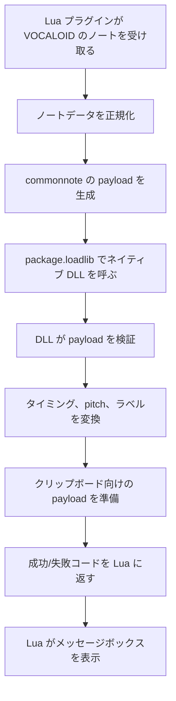

# VOCALOID 向け commonnote

言語を選択 / Select a language / Selecciona un idioma:

- [English](README.md)
- [Español](README.es.md)
- [日本語](README.ja.md)

このプロジェクトは、ExpressiveLabs の元の commonnote 形式でノートデータを交換するための VOCALOID Job Plugin です。

Lua スクリプトはホスト側の接続層です。現在の VOCALOID パートを読み取り、クリップボード用の payload を生成し、同じフォルダにあるネイティブライブラリを読み込みます。

重要: このドキュメントは、統合契約とフォルダ構成を説明するためのものです。Rust 実装そのものは意図的に含めていません。ネイティブコードは別の Rust プロジェクトにあり、実行時には `package.loadlib` で読み込まれます。

## クレジットと関連する公開プロジェクト

このプラグインは、ExpressiveLabs が作成・保守しているオリジナルの commonnote 形式を基にしています。

- 元プロジェクト: [ExpressiveLabs/commonnote](https://github.com/ExpressiveLabs/commonnote)
- Rust クレート: [commonnote on crates.io](https://crates.io/crates/commonnote)

この形式を利用または対応している公開実装・関連プロジェクトには、次のものがあります。

- [Mikoto Studio](https://mikoto.studio/) — クリップボードの既定データ構造として commonnote を使用
- [OpenUTAU](https://github.com/stakira/OpenUtau) — commonnote に対応した互換ホスト
- [UtaUtaUtau/commonnote-svs](https://github.com/UtaUtaUtau/commonnote-svs) — Synthesizer V Studio 向け実装
- [oxygen-dioxide/commonnote-utau](https://github.com/oxygen-dioxide/commonnote-utau) — UTAU 向け実装

このプロジェクトは、元の commonnote 仕様に沿っており、元の作者情報を置き換えたり再解釈したりしません。

## 1. VOCALOID 公式 API の使い方

このプラグインは、VOCALOID と SDK サンプルで使われている公式の Job Plugin スクリプトの形式に従っています。

### 主要なエントリポイント

- `manifest()`
  - プラグインのメタデータを返します。
  - 必須項目:
    - `name`
    - `comment`
    - `author`
    - `pluginID`
    - `pluginVersion`
    - `apiVersion`

- `main(processParam, envParam)`
  - Job Plugin の本体入口です。
  - `processParam` には選択範囲や時間データが入ります。
    - `beginPosTick`
    - `endPosTick`
    - `songPosTick`
  - `envParam` には実行環境が入ります。
    - `scriptDir`
    - `scriptName`
    - `tempDir`

### 使用している公式 API

このプロジェクトは、VOCALOID Job Plugin API の標準関数を利用しています。

- `VSMessageBox(...)`
- `VSDlgSetDialogTitle(...)`
- `VSDlgAddField(...)`
- `VSDlgDoModal()`
- `VSDlgGetStringValue(...)`
- `VSDlgGetIntValue(...)`
- `VSSeekToBeginNote()`
- `VSGetNextNote()`
- `VSGetNextNoteEx()`
- `VSInsertNote(...)`
- `VSRemoveNote(...)`
- `VSUpdateNoteEx(...)`
- `VSInsertNoteEx(...)`
- `VSGetMusicalPart()`
- `VSUpdateMusicalPart(...)`

これらは、SDK に同梱されている公式サンプルでも使われている関数群です。

### なぜ Lua スクリプトを Job Plugin として作るのか

VOCALOID には、外部スクリプトを通常のデスクトッププロセスとして実行する入口がありません。統合モデルは次の通りです。

1. VOCALOID が Lua の Job Plugin を読み込む
2. プラグインが公式 SDK 関数を呼ぶ
3. Lua スクリプトがホスト API 経由でノートを読み書きする
4. その後、相手エンジン向けのシリアライズ処理を DLL に委譲する

このため Lua スクリプトは単体のスクリプトではなく、ホスト連携用のブリッジです。

---

## 2. フォルダ構成とファイル配置

ネイティブ DLL は Lua スクリプトの隣に置く必要があります。実行時に script のディレクトリから解決するためです。

推奨構成:

```text
C:\path\to\vocaloid\plugins\
├── commonnote_ui.lua
├── commonnote.dll
├── README.md
├── README.es.md
├── README.ja.md
└── (必要に応じて一時ファイルやログ)
```

重要なルール:

```text
script フォルダ == DLL フォルダ
```

概念的な読み込みは次のようになります。

```lua
local dllPath = envParam.scriptDir .. "commonnote.dll"
local rust_dll = package.loadlib(dllPath, "process_notes_table_lua")
```

もし DLL が Lua と同じフォルダにいなければ、プラグインは見つけられず、通常のエラーメッセージで失敗します。

### なぜ DLL をスクリプトの近くに置く必要があるのか

DLL はグローバルなシステムライブラリではありません。Lua スクリプトと同じ実行コンテキストで読み込まれるプラグイン固有の構成要素です。スクリプトの横に置くことで次が確保されます。

- ホスト側からの発見が安定する
- 起動時の挙動が予測可能になる
- 複数バージョンのプラグインが混ざらない
- DLL が見つからない問題の再現とデバッグがしやすい

---

## 3. Lua スクリプトの役割

Lua 層はホストとの接続だけを担当します。完全なシリアライズ処理は含まず、VOCALOID API を呼び、実際の変換は DLL に委譲します。

### Lua の責務

- 現在のパートからノートを読む
- 全体または選択範囲を処理する
- ラベルとピッチを正規化する
- commonnote 用の payload を組み立てる
- ネイティブ DLL を読み込む
- 準備した payload をネイティブ層に渡す
- 結果を受け取り、成功/エラーのメッセージボックスを表示する

### DLL の責務

ネイティブ層は実際の変換とシリアライズを担当します。例:

- payload の構造を検証する
- 時間とピッチを正規化する
- VOCALOID のノート一覧を commonnote 互換形式へ変換する
- 結果をクリップボードへ書く、または Lua 側が使える形式で出力する
- Lua 側へ戻り値コードを返す

この境界は意図的です。Lua はホスト API を扱い、DLL は処理を担当します。

Rust プロジェクトは別管理で、ここでは明示しません。プラグインはエクスポートされたネイティブ関数を通して呼び出す設計になっています。

---

## 4. 実務上の留意点と設計ルール

先に理解しておくと、作業が安定しやすく、問題発生時の切り分けもしやすくなる重要なポイントがあります。

これは不満というより、ホスト連携の自然な制約です。

### 留意点 1: スクリプトのフォルダが正しくないと動かない

`envParam.scriptDir` が使えない場合、プラグインは DLL を見つけられません。その場合は、誤った状態のまま進むのではなく、明確なエラーで止まります。

### 留意点 2: DLL はプラグインと同じフォルダに置く必要がある

DLL がない、名前が違う、古い場合は、読み込み時にすぐ問題が表示されます。これは分かりやすい失敗であり、無音の失敗を避けるための設計です。

### 留意点 3: ホストはノートの厳密な選択リストではなく時間範囲を渡す

VOCALOID の Job Plugin コールバックは、通常、ノートの完全な選択オブジェクトではなく、tick の境界を渡します。そのためスクリプトは範囲ロジックを明示して、境界条件も意図的に扱います。

つまり、選択は最初に「時間の区間」として解釈され、その後、ユーザーに見える範囲と整合するように処理されます。

### 留意点 4: すべてのノートが歌詞ノートではない

ノートには歌詞テキスト、発音テキスト、または両方が入っている場合があります。エクスポート時には、現在のモードに対して適切なフィールドを選ぶ必要があります。

たとえば:

- 通常の export は `lyric` を使う
- フォニーム export は `phonemes` を使う

#### ⚠️ 推奨用途

フォニームのみの export は、主に個人用ツール、独自の音素割り当てワークフロー、実験的なプロトタイプ向けに想定されています。一般的なノート交換の標準形式を代替する用途ではありません。

#### ネイティブ音素を更新する手順

ネイティブ音素を正しく更新するには、`Lyrics -> Convert Phonemes` を実行してから、音素データを再利用またはエクスポートする必要があります。


### 留意点 5: プラグインは安全な範囲内に値を収める

スクリプトは pitch を MIDI の安全範囲 0..127 に丸め、空文字・`-`・`+` のようなプレースホルダーも正規化します。

これにより、payload を壊しにくくし、複数のホスト間で動作を揃えやすくしています。

### 留意点 6: 実行時のフィードバックは明示的に表示される

スクリプトはメッセージボックスと明確な成功/失敗状態を使って、各ステップで何が起きたかをユーザーに見せます。

これによって次のことが分かりやすくなります。

- DLL は読み込めたか
- ノートが見つかったか
- 選択範囲が空だったか
- export は成功したか
- クリップボード payload は生成できたか

---

## 5. DLL の処理フロー

ネイティブ層は、変換とシリアライズを担当します。理解しやすい流れは次の通りです。



これにより、2 つの層が明確に分かれます。

- Lua は VOCALOID API とユーザー操作を扱う
- DLL は変換と形式の検証を扱う
- 最終的な結果は、明確な成功/失敗としてホストへ返る

---

## 5. 実行時の重要な動作

### export フロー

1. VOCALOID から現在のノート一覧を取得する
2. 全体または選択範囲を適用する
3. ラベルとピッチを正規化する
4. ノート位置を相対値に変換する
5. DLL ブリッジを呼ぶ
6. export 結果を表示する

### import フロー

1. commonnote payload をクリップボードまたは生成済みデータから読み込む
2. 構造を解析する
3. resolution とノート内容を検証する
4. 目的の tick オフセットを適用する
5. 解像度が異なる場合に時間をスケーリングする
6. VOCALOID の現在のパートにノートを挿入する
7. 必要に応じて Musical Part の playTime を更新する

---

## 6. プラグインが期待するファイル

実行時のファイルセットは意図的に最小限です。

```text
plugins/
├── commonnote_ui.lua
├── commonnote.dll
├── README.md
├── README.es.md
├── README.ja.md
└── 必要に応じたログや一時ファイル
```

Lua スクリプトは、隠れた相対パスやグローバル DLL 登録に依存してはいけません。常に DLL はスクリプトの横に置くことが前提です。

---

## 7. 運用上のまとめ

このプラグインは次の橋渡しとして設計されています。

- VOCALOID の公式 Job Plugin API
- Lua ホストスクリプト
- Rust プロジェクトから生成されたネイティブ DLL
- commonnote payload 形式

プロジェクトは、見えるホスト層と分離したネイティブ処理層に分けてあります。これにより:

- VOCALOID との統合が明確に追跡できる
- ネイティブロジックがホストの詳細から切り離されている
- メッセージボックスや実行時エラーが起きたときにデバッグしやすい

---

## 8. 最後に

ユーザー向けの動作は意図的に明示的です。隠れた状態を持たず、無言で失敗しません。もし見えない場合、ほとんどは次のいずれかです。

- Lua が正しいプラグインフォルダにない
- DLL が見つからないか古い
- `scriptDir` が実行時に使えない
- 入力の選択範囲が空
- ホスト側で既知のエラーが返っている

そのような場合でも、プラグインは「何も起きたふり」をせず、明確に状態を示すように設計されています。
