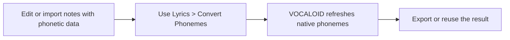
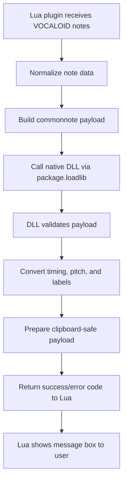

# commonnote for VOCALOID

Choose a language / Selecciona un idioma / 言語を選択:

- [English](README.md)
- [Español](README.es.md)
- [日本語](README.ja.md)

This project is a VOCALOID Job Plugin that exchanges note data in the original commonnote format from ExpressiveLabs.

The Lua script is the host-facing layer. It reads the current VOCALOID part, creates the clipboard payload, and loads the companion native library from the same folder as the script.

Important: this document explains the integration contract and folder layout. The Rust implementation itself is intentionally not included here; the native code lives in a separate Rust project and is loaded at runtime via `package.loadlib`.

## Credits and related public projects

This plugin is based on the original commonnote format created and maintained by ExpressiveLabs.

- Original project: [ExpressiveLabs/commonnote](https://github.com/ExpressiveLabs/commonnote)
- Rust crate: [commonnote on crates.io](https://crates.io/crates/commonnote)

Among the public implementations and related projects that use or support this format are:

- [Mikoto Studio](https://mikoto.studio/) — uses commonnote as a default clipboard data structure
- [OpenUTAU](https://github.com/stakira/OpenUtau) — compatible host with commonnote support
- [UtaUtaUtau/commonnote-svs](https://github.com/UtaUtaUtau/commonnote-svs) — Synthesizer V Studio implementation
- [oxygen-dioxide/commonnote-utau](https://github.com/oxygen-dioxide/commonnote-utau) — UTAU implementation

This project follows the original commonnote specification and does not reinterpret or replace its authorship.

## 1. Official VOCALOID API usage

This plugin follows the official Job Plugin script pattern used by VOCALOID and the SDK samples.

### Core entry points

- `manifest()`
  - Returns the plugin metadata.
  - Must include:
    - `name`
    - `comment`
    - `author`
    - `pluginID`
    - `pluginVersion`
    - `apiVersion`

- `main(processParam, envParam)`
  - The real entry point of the Job Plugin.
  - `processParam` contains selection/time data such as:
    - `beginPosTick`
    - `endPosTick`
    - `songPosTick`
  - `envParam` contains the runtime environment:
    - `scriptDir`
    - `scriptName`
    - `tempDir`

### Official API calls used

The project uses the standard functions provided by the VOCALOID Job Plugin API:

- `VSMessageBox(...)`
- `VSDlgSetDialogTitle(...)`
- `VSDlgAddField(...)`
- `VSDlgDoModal()`
- `VSDlgGetStringValue(...)`
- `VSDlgGetIntValue(...)`
- `VSSeekToBeginNote()`
- `VSGetNextNote()`
- `VSGetNextNoteEx()`
- `VSInsertNote(...)`
- `VSRemoveNote(...)`
- `VSUpdateNoteEx(...)`
- `VSInsertNoteEx(...)`
- `VSGetMusicalPart()`
- `VSUpdateMusicalPart(...)`

These are the same function families used in the official plugin samples shipped with the SDK.

### Why the script must be built as a Job Plugin

VOCALOID does not expose a normal desktop process entry point for arbitrary external script execution. The integration model is:

1. VOCALOID loads the Lua Job Plugin
2. the plugin calls the official SDK functions
3. the Lua script reads and writes note data through the host API
4. the plugin then calls the companion DLL for the cross-engine serialization layer

This is the reason the Lua script is not a standalone script; it is a host plugin bridge.

---

## 2. Required folder layout and file placement

The native DLL must live next to the Lua script, because the plugin resolves it from the script directory at runtime.

Recommended structure:

```text
C:\path\to\vocaloid\plugins\
├── commonnote_ui.lua
├── commonnote.dll
├── README.md
├── README.es.md
├── README.ja.md
└── (optional temporary files or logs)
```

The important rule is:

```text
script folder == DLL folder
```

The load call is expected to look like this conceptually:

```lua
local dllPath = envParam.scriptDir .. "commonnote.dll"
local rust_dll = package.loadlib(dllPath, "process_notes_table_lua")
```

If the DLL is not next to the Lua file, the plugin cannot find it and the operation fails with the standard error message.

### Why the DLL must be local to the script

The DLL is not a global system library. It is a plugin-local component that is loaded in the same runtime context as the Lua script. Keeping it beside the script ensures:

- correct discovery by the Lua host
- predictable startup behavior
- no ambiguity between multiple plugin versions
- easier reproduction and debugging when the host reports a missing library

---

## 3. What the Lua script does

The Lua layer is responsible for the host integration only. It does not contain the full serialization logic; it coordinates the VOCALOID API calls and delegates the actual conversion work to the DLL.

### Lua responsibilities

- read notes from the current musical part
- filter notes by selection or full song
- normalize labels and pitch values
- build the commonnote data payload
- load the native DLL
- pass the prepared payload to the native layer
- receive the result and display the success/error message box

### DLL responsibilities

The native layer is responsible for the actual note conversion and serialization work, such as:

- validating the payload structure
- normalizing note timing and pitch data
- converting the VOCALOID note list into the commonnote-compatible format
- copying the result to clipboard or preparing the output that the Lua layer exposes
- returning a result code to the Lua host layer

This boundary is deliberate: Lua handles host API calls, the DLL handles processing.

The Rust project is managed separately and is intentionally not included in this README for clarity and safety. The plugin calls the exported native function without exposing the implementation code here.

---

## 4. Practical notes and design rules

A few project decisions are important to understand in advance so the workflow stays predictable and easy to diagnose.

These are not complaints; they are simply the expected constraints of a host plugin bridge.

### Note 1: the plugin needs the script folder to be valid

If `envParam.scriptDir` is unavailable, the plugin cannot locate the DLL. In that case, the script stops with a clear error instead of continuing with a misleading state.

### Note 2: the DLL must be built and copied alongside the plugin

If the DLL is missing, renamed, or outdated, the plugin reports the issue immediately. This makes the problem visible and avoids confusing silent failures.

### Note 3: the host provides a time range, not a perfect selected-note list

VOCALOID Job Plugin callbacks usually work with tick boundaries, not with a strict user-selected note list object. Because of that, the script applies explicit range logic and handles edge cases intentionally.

This means a selection is interpreted as a time interval first, and the plugin does its best to match the user-visible range in a consistent way.

### Note 4: not every note is necessarily a lyric note

A note may contain lyric text, phoneme text, or both, depending on how the phrase was authored. The exporter chooses the right field for the current mode.

For example:

- normal export uses the lyric field
- phoneme export uses the phoneme field when available

#### ⚠️ Recommended use

Phoneme-only export is intended mainly for personal tools, custom phonetic assignment workflows, and experimental prototypes. It is not meant to replace the general-purpose exchange of standard note data.

#### Native phoneme refresh flow

To update the native VOCALOID phonemes correctly, the user must use the `Lyrics -> Convert Phonemes` menu before reusing or exporting phonetic data.



### Note 5: the plugin keeps values within safe bounds

The script clamps pitch values to MIDI-safe bounds 0..127 and normalizes placeholder labels such as empty strings, `-`, and `+` to the canonical placeholder.

This protects the payload and makes the behavior consistent across hosts.

### Note 6: runtime feedback is intentionally visible

The script shows message boxes and explicit success/error states so the user can see what happened at each step.

This is helpful for understanding whether:

- the DLL loaded successfully
- notes were found
- the selection was empty
- the export completed
- the clipboard payload was generated

---

## 5. DLL process flow

The native layer is responsible for the conversion and serialization work. The flow is conceptually:



This keeps the host integration layer and the processing layer separated:

- Lua handles the VOCALOID API and user interaction
- the DLL handles transformation and format validation
- the final result is returned to the host as a clear success/error response

---

## 5. Important runtime behavior

### Export flow

1. Query the current note list from VOCALOID
2. Apply the selected range or export all notes
3. Normalize labels and pitch values
4. Convert note positions to relative values
5. Call the DLL bridge
6. Display the export result

### Import flow

1. Load the commonnote payload from the clipboard or from the generated runtime data
2. Parse the structure
3. Validate resolution and note fields
4. Apply the destination tick offset
5. Scale timing when source and target resolution differ
6. Insert notes into the current VOCALOID part
7. Refresh the musical part play time if required

---

## 6. Files expected by the plugin

The runtime file set is intentionally minimal:

```text
plugins/
├── commonnote_ui.lua
├── commonnote.dll
├── README.md
├── README.es.md
├── README.ja.md
└── optional logs or temp files
```

The Lua script should never depend on hidden relative paths or system-wide DLL registration. The expectation is always that the DLL sits beside the script.

---

## 7. Operational summary

This plugin is designed as a bridge between:

- the official VOCALOID Job Plugin API
- the Lua host script
- the native DLL created from the Rust project
- the commonnote payload format

The project is intentionally split into a visible host layer and a separate native processing layer so that:

- the VOCALOID integration remains clear and traceable
- the native logic remains isolated from the plugin host details
- the plugin behavior is easier to diagnose when a message box or runtime error appears

This separation is part of the design and is the main reason the plugin can be debugged without exposing the Rust implementation in this document.

---

## 8. Final note

The user-facing workflow is intentionally explicit: no hidden state, no silent failures, no vague behavior. If the plugin is not visible, the most likely reason is one of the following:

- the Lua file is not in the expected plugin folder
- the DLL is missing or outdated
- `scriptDir` is not available at runtime
- the input selection is empty
- the plugin returned a known host-side error message

In all of those cases, the plugin is designed to surface the condition clearly rather than pretending it worked.
